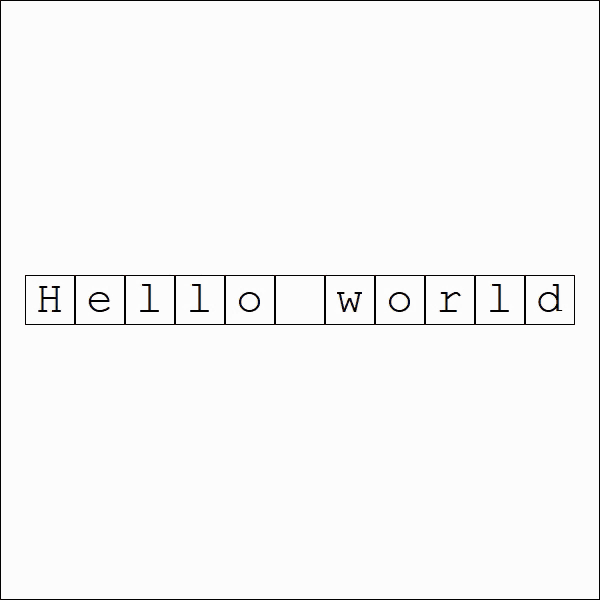

# Truchet Tiling Generator

## Project Overview
This project implements a Python script to generate visual representations of Truchet tiles based on the ASCII binary representation of a given text string. Truchet tiles are a form of tiling where each tile has a simple pattern, which when combined, can create complex and visually appealing structures. This script takes a string, converts it into ASCII binary code, and then maps these binary sequences to specific Truchet tile patterns.

## Acknowledgments
- Inspiration from the classic Truchet tiling in mathematics and art.
- [Vitaliy Kaurov, WOLFRAM Research](https://community.wolfram.com/groups/-/m/t/3166774)

---

This README template provides a clear and concise description of your project, how to set it up, and how to use it, making it easier for others to understand and contribute to the project. Adjust paths, links, or any specific details according to your actual GitHub repository structure and preferences.